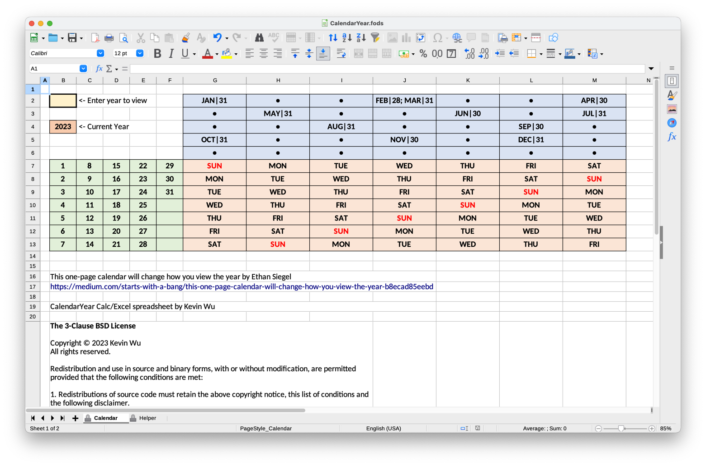

### Screenshot

***

### About CalendarYear
- **CalendarYear** is a spreadsheet implementation of the one-page calendar described by Ethan Siegel in the article [This one-page calendar will change how you view the year](https://medium.com/starts-with-a-bang/this-one-page-calendar-will-change-how-you-view-the-year-b8ecad85eebd). A calendar for an entire year is represented in a compact form. How to use the calendar and its advantages over the conventional 12-month calendar presentation are described in Dr. Siegel's article.
- The user can enter a year in the yellow cell at B2 to display the calendar for any year from 1582 (when the Gregorian calendar was first adopted) to 3000.
- Most users will interact with the Calendar sheet only. It displays the calendar for an entire year, and it lets the user select the year to display.
- The Helper sheet implements calendar calculations, and most users will not need to look at that sheet.
- CalendarYear is released in the file format of type **FODS**, OpenDocument Flat XML Spreadsheet Document Format. This is a text file that works better with git, the version control system at the heart of GitHub. LibreOffice Calc can open documents of this type. Excel cannot open this file type directly, and Excel users will need to convert the FODS format to either ODS or XLSX with LibreOffice Calc, which is available for free.

## Setting Up CalendarYear
The CalendarYear.fods file can be opened directly by LibreOffice Calc. It cannot be opened directly by Microsoft Excel. Excel users will need use LibreOffice Calc to export the document from Calc to a file of type ODS or XLSX.
***

## FAQs
A list of frequently asked questions:
1. **Why would I use this calendar?** 
CalendarYear presents the calendar for an entire year in a compact form. Given a particular year and any two of the following three values &mdash; month, day of week, day of month &mdash; the user can easily determine the unknown third value. For more details, read the article [This one-page calendar will change how you view the year](https://medium.com/starts-with-a-bang/this-one-page-calendar-will-change-how-you-view-the-year-b8ecad85eebd) by Ethan Siegel. Some examples of questions CalendarYear can answer:
	1. When I was born, what was the week day?
	2. What months have the 13th day on Friday, which is unlucky according to Western superstition?
	3. When does Daylight Saving Time start this year? Hint: On the second Sunday of March in the United States, but what day is that?
2. **How do I open this file CalendarYear.fods?** 
Open the file with the application LibreOffice Calc, which is available for free from [LibreOffice](https://www.libreoffice.org/). Calc can execute the spreadsheet and/or export the FODS file to file formats ODS or XLSX for Microsoft Excel.
3. **Can I open this file with Google Sheets?** 
Unfortunately, Google Sheets cannot parse the formulas in Calendar Sheet so Google Sheets is not supported at this time.
4. **What range of years does CalendarYear support?** 
CalendarYear supports years from 1582 (when the Gregorian calendar was first adopted by a few European countries influenced by the Catholic Church) to 3000. Whether the Gregorian calendar in its present form will be in use through the year 3000 is unknown at present.
5. **How do I enter a year to display?** 
Click on the yellow cell at B2. Enter a whole number in the range [ 1582, 3000 ] and accept the entry with the return key or click the green checkbox in the data entry part of the application. Deleting the contents of this cell defaults the displayed year to the current year.
6. **What are the numbers after the month abbreviations?** 
The month abbreviations are separated from the number of days in that month by a vertical bar. For example, FEB|28 means that February has 28 days in the year being displayed.
7. **Why can't I change any cells other than B2?** 
All other cells are protected from changes. Casual users will not need to change most cells and doing so may cause the sheet to malfunction.
8. **I am a power user, and I want to change the sheet. How can I do this?** 
The sheet protection lacks a password so power users can disable protection and change the sheet. The protection is in place to prevent casual users from inadvertently changing cells to the detriment of its functionality.
9. **Can I store my appointments and tasks in this calendar?** 
No, a spreadsheet is suitable for displaying tables of data and for calculating values, but it is not flexible enough to store user's private information and keep it safe from malware or curious associates. The purpose of CalendarYear is to help users look-up date information.
10. **How does this sheet work under the hood?** 
If a given month's first day of week and the number of days in the month are known, the remainder resulting from dividing the number of month days by 7 × 4 = 28 is 0 (for February on non-leap years), 1 (for February on leap years), 2 (for 30-day months), or 3 (for 31-day months). This remainder is the number of days to add to the current month's first day of week to determine the first day of week of the next month. CalendarYear uses this tidbit to construct two static lists of months, one list for non-leap years, and the other for leap years. The spacings between months are the remainder values.  
To use the lists of months, two values need to be computed. The first value is whether this year is a leap year. From the Wikipedia article on [leap year](https://en.wikipedia.org/wiki/Leap_year), a year is a leap year in the Gregorian calendar if it divisible by 400 or if it is divisible by 4 and not divisible by 100. For example, 1600 and 2000 are leap years because they are divisible by 400, whereas 1700, 1800, and 1900 are not leap years because they are divisible by 100. The second value is the day of week of January 1st in this year. From the Wikipedia article on [determination of the day of the week](https://en.wikipedia.org/wiki/Determination_of_the_day_of_the_week), CalendarYear uses a simplified version of Tomohiko Sakamoto's method: Since the month is fixed to January and the day is fixed to 1, no conditional evaluation and no table lookup are needed.  
On the Calendar sheet, the months "move" around based on whether the year is a leap year and the day of week of January 1st. These two values and the coordinates of the month matrix determine the value displayed in each element of the month matrix. The leap year value selects the column of the month lists and the day of week of January 1st contributes to selecting the row value.